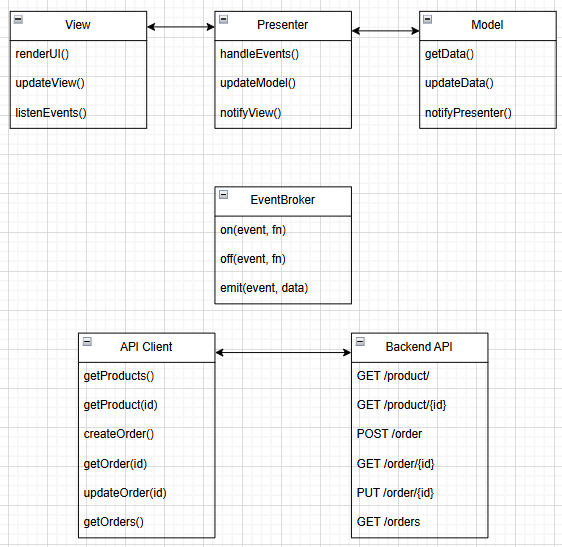

# Проектная работа "Веб-ларек"

## 1. Описание проекта
**Web-ларёк** – это интернет-магазин для веб-разработчиков, предоставляющий возможность просмотра каталога товаров, добавления их в корзину и оформления заказов. 

Проект построен на MVP (Model-View-Presenter) с событийным управлением через EventBroker, что обеспечивает гибкость, расширяемость и слабую связанность компонентов (Presenter используется для связывания данных и представления, но можно заменить его на Controller, если потребуется другая архитектура).

Использование архитектуры MVP + EventBroker обусловлено необходимостью обеспечения слабой связанности между компонентами, что упрощает поддержку и расширение функционала. Такой подход позволяет эффективно управлять событиями и данными, избегая жестких зависимостей между частями приложения. MVC в данном случае создавал бы излишнюю связанность между представлением и контроллером. Flux мог бы подойти, но его сложность не оправдана для сравнительно небольшого проекта.

Стек: HTML, SCSS, TS, Webpack

Структура проекта:
- src/ — исходные файлы проекта
- src/components/ — папка с JS компонентами
- src/components/base/ — папка с базовым кодом

Важные файлы:
- src/pages/index.html — HTML-файл главной страницы
- src/types/index.ts — файл с типами
- src/index.ts — точка входа приложения
- src/scss/styles.scss — корневой файл стилей
- src/utils/constants.ts — файл с константами
- src/utils/utils.ts — файл с утилитами


### 1.1 Основные возможности
#### 1.1.1 UX-функции:
- Каталог товаров с возможностью фильтрации и сортировки.
- Интерактивные уведомления и обработка ошибок.
- Отмена заказов и просмотр истории покупок.
- Автоматическое обновление интерфейса при изменениях данных.
- Модальные окна с возможностью закрытия по клику вне них.
- Индикатор загрузки данных.
- Отображение корректных ошибок API (например, неверная сумма заказа, отсутствие адреса доставки).
- Учет товаров со статусом "Бесценно".
- Использование "синапсов" в качестве валюты.

#### 1.1.2. Бизнес-логика:
- Добавление/удаление товаров в корзину и управление их количеством.
- Выбор способа оплаты (онлайн / наличные при получении).
- Валидация данных перед оформлением заказа (адрес, email, телефон).
- Проверка наличия товаров в каталоге и соответствие сумме заказа на сервере.
- Граничные случаи, например:
    - Заказ товара, которого нет в наличии.
    - Ошибки API и их обработка.
    - Работа с "Бесценными" товарами.

#### 1.1.3. Технические детали:
- Кеширование данных для уменьшения запросов к серверу.  
- Обработка ошибок API-клиентом и отображение пользователю.
- Учет состояний приложения (загрузка, ошибки, всплывающие уведомления).

## 2. Архитектура
### 2.1 Основные компоненты

1. Model  – управляет бизнес-логикой, обрабатывает данные и взаимодействует с API.
2. View  – отвечает за рендеринг интерфейса и генерацию событий пользователя.
3. Presenter  – посредник между View и Model, управляет логикой представления.
4. EventBroker – реализует паттерн "Наблюдатель" и управляет событиями в системе.

### 2.2 Взаимодействие компонентов
- Model хранит и управляет бизнес-данными, взаимодействует с сервером и генерирует события через EventBroker.
- View отображает данные, генерирует пользовательские события и реагирует на изменения данных, не храня состояние внутри.
- Presenter связывает Model и View, слушает события от View и изменяет данные в Model.
- EventBroker управляет подпиской и генерацией событий для слабой связанности компонентов.

## 3. Экраны, Компоненты, Классы

### 3.1 Экраны

- Главная страница: отображает каталог товаров (`CatalogView`), модальное окно товара (`ModalWindow`), кнопку для перехода в корзину со счётчиком товаров (`HeaderView`).
- Каталог товаров (`CatalogView`): список товаров, фильтрация и сортировка.
- Корзина (`CartView`): содержит список товаров, кнопки управления количеством, кнопку оформления заказа.
- Оформление заказа: два этапа – ввод адреса (`AddressForm`), затем ввод email и телефона (`CustomerInfoForm`), выбор метода оплаты.
- Подтверждение заказа: отображает итоговый заказ, подтверждает оплату, отправляет уведомление.
- Модальные окна (`ModalWindow`): отображение детальной информации о товаре и других данных.
- Уведомления (`Notification`): показывают ошибки, успехи, предупреждения.
- Ошибка / загрузка (`ErrorView`, `LoadingView`): обработка ошибок и индикатор загрузки данных.


### 3.2 Компоненты

- ProductCard – карточка товара.
- Cart – корзина товаров.
- OrderForm – форма оформления заказа.
- ModalWindow – модальные окна для детальной информации.
- Notification – уведомления об успехе или ошибках.
- HeaderView - отображение кнопки корзины и счетчика количества добавленных товаров.
    

### 3.3 Классы и их назначения
#### 3.3.1 Model (модели данных)

##### 3.3.1.1 Модель товара
```ts
export interface Product {
  id: string;
  title: string;
  category: string;
  price: number | null;
  description: string;
  image: string;
}
```
Назначение: описывает товар.
##### 3.3.1.2 Модель корзины
```ts
interface Cart {
  items: Product[];
  
  addItem(product: Product): void; // Добавляет товар.
  removeItem(productId: string): void; // Удаляет товар.
  clearCart(): void; // Очищает корзину.
}
```
Назначение: Управление товарами в корзине.
##### 3.3.1.3 Модель заказа
```ts
interface Order {
  id: string;
  paymentMethod: 'card' | 'cash';
  deliveryAddress: string;
  customerEmail: string;
  customerPhone: string;
  timestamp: string;
    
  validateOrder(): string | null; // Проверяет корректность введённых данных
  createOrderToPost(items: string[], total: number): OrderToPost;
}

interface OrderToPost {
  payment: 'card' | 'cash';
  address: string;
  email: string;
  phone: string;
  total: number;
  items: string[];
}

validateOrder(): string | null {
  if (!this.deliveryAddress) return 'Введите адрес доставки';
  if (!this.customerEmail.includes('@')) return 'Введите корректный email';
  if (!this.customerPhone.match(/^\+7[0-9]{10}$/)) return 'Введите корректный номер телефона';
  if (!['card', 'cash'].includes(this.paymentMethod)) return 'Выберите корректный способ оплаты';
  return null;
}
```
Назначение: Хранение информации о заказе и его валидация. Генерация данных для отправки на сервер происходит отдельно методом createOrderToPost.

##### 3.3.1.4 Модель каталога товаров
```ts
interface Catalog {
  products: Product[];

  setProducts(products: Product[]): void; // Устанавливает список товаров после загрузки с сервера.
  getProducts(): Product[]; // Возвращает список товаров.
}
```
Назначение: управление списком товаров (каталогом).
#### 3.3.2 View (отображения)
##### 3.3.2.1 ProductCard (Карточка товара)
```ts
    class ProductCard {
      render(product: Product): HTMLElement {}
    }

```
Назначение: Отображает товар.

##### 3.3.2.2 CartView (Отображение корзины)
```ts
class CartView {
  private cartContainer: HTMLElement;
  private totalContainer: HTMLElement;

  constructor(cartContainerSelector: string, totalContainerSelector: string) {
    this.cartContainer = document.querySelector(cartContainerSelector)!;
    this.totalContainer = document.querySelector(totalContainerSelector)!;
  }

  render(cart: Cart): void {
    this.cartContainer.innerHTML = "";
    cart.items.forEach((product) => {
      const productElement = document.createElement("div");
      productElement.classList.add("cart-item");
      productElement.innerHTML = `
        <span>${product.title} - ${product.price ?? "Бесценно"}</span>
        <button class="remove-item" data-id="${product.id}">Удалить</button>
      `;
      this.cartContainer.appendChild(productElement);
    });
    this.updateTotal(cart);
  }

  updateTotal(cart: Cart): void {
    const total = cart.items.reduce((sum, product) => sum + (product.price ?? 0), 0);
    this.totalContainer.textContent = `Итого: ${total} синапсов`;
  }

  bindRemoveHandler(handler: (productId: string) => void): void {
    this.cartContainer.addEventListener("click", (event) => {
      const target = event.target as HTMLElement;
      if (target.classList.contains("remove-item")) {
        const productId = target.dataset.id!;
        handler(productId);
      }
    });
  }
}
```
Назначение: Отображает корзину.

##### 3.3.2.3 OrderForm (Форма заказа в двух представлениях)
```ts
class AddressForm {
  render(): HTMLElement; // возвращает форму для ввода адреса и выбора метода оплаты
}

class CustomerInfoForm {
  render(): HTMLElement; // возвращает форму для ввода email и телефона
}
```
Назначение: Форма оформления заказа.


##### 3.3.2.4 CatalogProductCard (карточка товара в каталоге):
```ts
class CatalogProductCard {
  render(product: Product): HTMLElement; // возвращает карточку с краткой информацией
}

```

Назначение: карточка в списке товаров, отображается минимальная информация.

##### 3.3.2.5 ModalProductCard (карточка товара в модальном окне):
```ts
class ModalProductCard {
  render(product: Product): HTMLElement; // возвращает полную информацию о товаре с кнопкой добавления в корзину
}

```
Назначение: подробное описание товара в модальном окне.

##### 3.3.2.6 CartProductCard (карточка товара в корзине):
```ts
class CartProductCard {
  render(product: Product): HTMLElement; // возвращает карточку в корзине с кнопкой удаления
}

```
Назначение: отображение товара в корзине, упрощенный вид, кнопка удаления.

##### 3.3.2.7 HeaderView (кнопка корзины и счётчик):
```ts
class HeaderView {
  cartButton: HTMLElement;
  itemCountBadge: HTMLElement;

  constructor(cartButtonSelector: string, itemCountSelector: string) {
    this.cartButton = document.querySelector(cartButtonSelector)!;
    this.itemCountBadge = document.querySelector(itemCountSelector)!;
  }

  render(): HTMLElement {
    const header = document.createElement("header");
    header.innerHTML = `
      <button id="cart-btn">Корзина</button>
      <span id="cart-count">0</span>
    `;
    return header;
  }

  renderItemCount(count: number): void {
    this.itemCountBadge.textContent = count.toString();
  }

  bindCartButtonClick(handler: () => void): void {
    this.cartButton.addEventListener("click", handler);
  }
}
```

##### 3.3.2.8 CatalogView (общее представление страницы каталога)
```ts
class CatalogView {
    render(products: Product[]): HTMLElement {
        // Рендерит список карточек товаров
    }
}
```
Назначение: отвечает за отображение списка товаров на главной странице.

##### 3.3.2.8 ModalWindow (Модальное окно)

```ts
class ModalWindow {
  private container: HTMLElement;
  private content: HTMLElement;
  
  constructor() {
    this.container = document.createElement('div');
    this.container.classList.add('modal-container');
    this.content = document.createElement('div');
    this.content.classList.add('modal-content');
    this.container.appendChild(this.content);

    this.container.addEventListener('click', (event) => {
      if (event.target === this.container) {
        this.close();
      }
    });
  }

  render(content: HTMLElement): void {
    this.content.innerHTML = '';
    this.content.appendChild(content);
    document.body.appendChild(this.container);
  }

  close(): void {
    if (this.container.parentElement) {
      document.body.removeChild(this.container);
    }
  }
}
```

- `render(content: HTMLElement): HTMLElement` – отображает переданный контент.
- `close()` - закрытие окна происходит при клике вне окна или на кнопку закрытия.

Назначение: отображение дополнительной или детальной информации, например, подробностей товара.

##### 3.3.2.8 Notification (Уведомления)

```ts
class Notification {
  showSuccess(message: string): void; // Показывает уведомление об успехе.
  showError(message: string): void; // Показывает уведомление об ошибке.
    
  // показывает уведомление об успешном заказе
  showOrderSuccess(orderId: string, total: number): void {
    this.showSuccess(`Заказ ${orderId} оформлен. Списано ${total} синапсов.`);
  }
    
}
```

Методы:
- `showSuccess(message: string): void` – показывает уведомление об успехе.
- `showError(message: string): void` – показывает уведомление об ошибке.

Назначение: Отображение уведомлений об успехе или ошибках.

##### 3.3.2.9 ErrorView и LoadingView (Уведомления)
```ts
class ErrorView {
  render(errorMessage: string): HTMLElement {
    const container = document.createElement("div");
    container.innerHTML = `<p class="error">Ошибка: ${errorMessage}</p>`;
    return container;
  }
}

class LoadingView {
  render(): HTMLElement {
    const container = document.createElement("div");
    container.innerHTML = `<p class="loading">Загрузка...</p>`;
    return container;
  }
}
```

##### 3.3.2.10 OrderSuccessView (Подтверждение заказа)
```ts
class OrderSuccessView {
  render(orderId: string, total: number): HTMLElement {
    const container = document.createElement('div');
    container.innerHTML = `<h2>Заказ ${orderId} оформлен!</h2><p>Списано ${total} синапсов.</p>`;
    return container;
  }
}
```
Назначение: отображает финальный экран подтверждения заказа.

#### 3.3.3 Presenter (презентер)
```ts
class Presenter {
  model: Cart | Order;
  view: any;
  eventBroker: EventBroker;

  constructor(model: Cart | Order, view: any, eventBroker: EventBroker) { }
  
  init(): void; // Инициализирует слушатели событий.
  handleEvent(payload: any): void; // Обрабатывает события.
}
```
#### 3.3.2 Event Broker (брокер событий)
```ts
class EventBroker {
  events: { [key: string]: Function[] };

  constructor() { }
  on(event: string, callback: Function): void; // Подписка на событие.
  off(event: string, callback: Function): void; // Отписка от события.
  emit(event: string, data?: any): void; // Генерация события.
}
```
EventBroker реализует паттерн "Наблюдатель" и отвечает за реактивность приложения:
- Подписка и отписка от событий (`on`, `off`).
- Генерация событий (`emit`).
- Распространение событий между View и Model через Presenter.

Схема взаимодействия с EventBroker

    graph TD;
        View -->|генерирует событие| EventBroker;
        EventBroker -->|рассылает событие| Presenter;
        Presenter -->|обновляет данные| Model;
        Model -->|генерирует новое событие| EventBroker;
        EventBroker -->|обновляет UI| View;
        
### 3.4. События

| Событие | Описание | Payload |
| --- | --- | --- |
| `add_to_cart` | Добавить товар в корзину | `{ productId: string }` |
| `remove_from_cart` | Удалить товар из корзины | `{ productId: string }` |
| `open_cart` | Открыть корзину | -   |
| `open_product` | Открыть карточку товара | `{ productId: string }` |
| `start_checkout` | Начать оформление заказа | -   |
| `submit_address` | Адрес доставки введен | `{ address: string, payment: string }` |
| `submit_customer_info` | Email и телефон введены | `{ email: string, phone: string }` |
| `order_success` | Заказ успешно оформлен | `{ orderId: string, total: number }` |
| `order_failed` | Ошибка при оформлении заказа | `{ error: string }` |
| `close_modal` | Закрыть модальное окно | -   |

### 3.5 Состояние приложения
```ts
interface AppState {
  loading: boolean;
  error: string | null;
  modalOpen: boolean;
  currentView: 'catalog' | 'cart' | 'checkout';
}
```


## 4. API и взаимодействие с сервером
Проект взаимодействует с сервером через REST API.  
Используемые эндпоинты:

| **Метод** | **Эндпоинт**    | **Описание**                                |
|-----------|-----------------|---------------------------------------------|
| `GET`     | `/product/`     | Получение списка товаров                    |
| `GET`     | `/product/{id}` | Получение информации о товаре               |
| `POST`    | `/order`        | Создание заказа                             |
| `GET`     | `/order/{id}`   | Получение информации о заказе               |
| `PUT`     | `/order/{id}`   | Обновление заказа (новый)                   |
| `GET`     | `/orders`       | Получение всех заказов пользователя (новый) |
| `DELETE`  | `/order/{id}`   | Отмена заказа                               |

Ошибки API и их обработка:
- `400 Bad Request` – неверные параметры запроса.
- `404 Not Found` – товар или заказ не найден.
- `500 Internal Server Error` – проблемы на стороне сервера.

### 4.1 API-клиент

API-клиент выполняет HTTP-запросы и обрабатывает ответы от сервера. В случае ошибок корректно обрабатывает их и возвращает сообщения пользователю.
```ts
    class ApiClient {
      async getProducts(): Promise<Product[]> {
        try {
          const response = await fetch('/api/products');
          if (!response.ok) throw new Error('Ошибка загрузки товаров');
          return await response.json();
        } catch (error) {
          console.error(error);
          throw new Error('Не удалось загрузить товары');
        }
      }
    
      async getProductById(id: string): Promise<Product> {
        try {
          const response = await fetch(`/api/products/${id}`);
          if (!response.ok) throw new Error('Ошибка загрузки товара');
          return await response.json();
        } catch (error) {
          console.error(error);
          throw new Error('Не удалось загрузить информацию о товаре');
        }
      }
    
      async createOrder(order: Order): Promise<{ success: boolean }> {
        try {
          const response = await fetch('/api/orders', {
            method: 'POST',
            headers: { 'Content-Type': 'application/json' },
            body: JSON.stringify(order)
          });
          if (!response.ok) throw new Error('Ошибка оформления заказа');
          return await response.json();
        } catch (error) {
          console.error(error);
          throw new Error('Не удалось оформить заказ');
        }
      }
    }
```
Обработка ошибок:
- `Ошибка загрузки товаров` → Возвращается пустой список и сообщение пользователю.
- `Ошибка загрузки товара` → Сообщение "Товар не найден".
- `Ошибка оформления заказа` → Проверка корректности данных перед отправкой.


### 4.2. Получение списка товаров
`GET /product/`
```json
{
  "total": 10,
  "items": [
    {
      "id": "1234",
      "title": "HEX-леденец",
      "category": "другое",
      "price": 1450,
      "description": "Лизните этот леденец, чтобы мгновенно запоминать цвета.",
      "image": "/hex-lollipop.svg"
    },
    {
      "id": "5678",
      "title": "Мамка-таймер",
      "category": "софт-скил",
      "price": null,
      "description": "Будет стоять над душой и не давать прокрастинировать.",
      "image": "/mom-timer.svg"
    }
  ]
}
```
### 4.3. Создание заказа
`POST /order`
```json
{
  "payment": "cash",
  "email": "test@test.ru",
  "phone": "+71234567890",
  "address": "ул. Пушкина, д. 4",
  "total": 2200,
  "items": ["1234", "5678"]
}
```
### 4.4. Обновление заказа
`PUT /order/{id}`
```json
{
  "payment": "card",
  "address": "ул. Новая, д. 10",
  "items": ["1234"]
}
```
### 4.5. Получение всех заказов
`GET /orders`
```json
{
  "orders": [
    {
      "id": "abcd123",
      "total": 2200,
      "status": "paid",
      "createdAt": "2024-03-15T12:00:00Z"
    },
    {
      "id": "efgh456",
      "total": 750,
      "status": "pending",
      "createdAt": "2024-03-16T09:30:00Z"
    }
  ]
}
```


## 5. API-клиент
```ts
class ApiClient {
  async getProducts(): Promise<Product[]> {
    return fetch('/api/products').then(res => res.json());
  }

  async getProductById(id: string): Promise<Product> {
    return fetch(`/api/products/${id}`).then(res => res.json());
  }
  async createOrder(order: Order): Promise<{ success: boolean }> {
    return fetch('/api/orders', {
      method: 'POST',
      headers: { 'Content-Type': 'application/json' },
      body: JSON.stringify(order)
    }).then(res => res.json());
  }
}
```

## 6. Используемый стек
- TypeScript – типизация и безопасная разработка.
- Parcel – сборка проекта.
- SCSS – стилизация компонентов.
- EventEmitter – управление событиями.
- .env – хранение переменных окружения (`API_ORIGIN=https://larek-api.nomoreparties.co`).

## 7. UML-схема



Описание:
- View – отвечает за рендеринг интерфейса.  
- Presenter – связывает View и Model.  
- Model – хранит и обрабатывает данные.  
- EventBroker** – управляет событиями.  
- API Client** – выполняет HTTP-запросы.  
- Backend API** – предоставляет данные.


## 8. Интерактивный UX
- Добавление и удаление товаров из корзины кнопками "Купить"/"Убрать".
- Закрытие модальных окон по клику вне них.  
- Выбор способа оплаты перед оформлением заказа.  
- Отображение ошибок при незаполненных полях.  
- Автоматическое обновление корзины при изменении данных.  
### 8.1 Карточка товара (ProductCard)
Карточка товара отображает товар с изображением, названием, ценой и кнопкой "Купить".
Элементы:
- Изображение товара
- Название товара
- Категория
- Цена
- Кнопка "Купить" / "Удалить из корзины"
    
События:
- Нажатие на кнопку "Купить" → `add_to_cart`
- Нажатие на кнопку "Удалить" → `remove_from_cart`
    

### 8.2 Корзина (Cart)
Корзина показывает список товаров, добавленных в корзину, с возможностью изменения количества и удаления.

Элементы:
- Список товаров
- Итоговая сумма
- Кнопка "Оформить заказ"
    
События:
- Изменение количества товара → `update_cart`
- Нажатие "Оформить заказ" → `checkout`
    

### 8.3 Форма оформления заказа
Форма, позволяющие ввести адрес, email, телефон и выбрать метод оплаты.

Элементы:
- Поле ввода адреса доставки
- Поле ввода email
- Поле ввода телефона
- Выбор метода оплаты (карта / наличные)
- Кнопка "Подтвердить заказ"
    
События:
- Ввод данных → `input_change`
- Выбор метода оплаты → `payment_method_selected`
- Нажатие "Подтвердить заказ" → `checkout`


## 9. Установка и запуск
Для установки и запуска проекта необходимо выполнить команды
```
npm install
npm run start
```
или
```
yarn
yarn start
```

## Сборка
```
npm run build
```
или
```
yarn build
```

